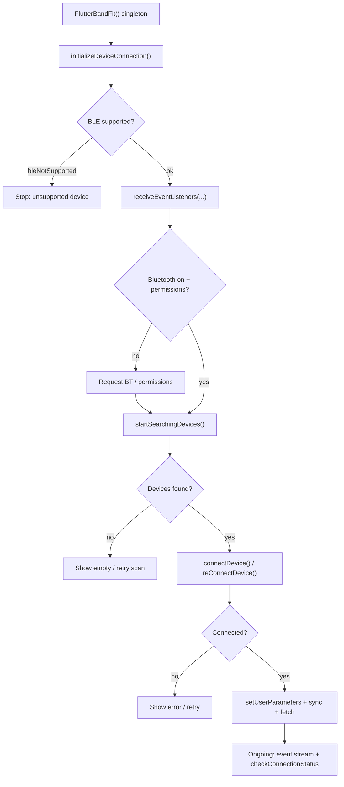

# flutter_band_fit

Flutter plugin for **UTE smart band / fitness watch** BLE connectivity on Android and iOS.

## Overview

- This plugin integrates the **UTE SDK** used by many UTE/GloryFit-class bands. On Android and iOS the vendor packages differ, but they implement the same **GloryFit SDK** capabilities (scan, bind, sync vitals, dial faces, firmware, device settings).
- **Primary goal:** expose one **common Dart platform** so Flutter apps do not maintain parallel native SDK integrations on each OS.
- **Reference implementation:** the [`example/`](example/) app (`flutter_band_fit_app`) is a complete demo — pairing, dashboard, detail charts, device settings, dial upload, and health export patterns.

## Features

- Scan, pair, connect, disconnect, and reconnect BLE band devices
- Sync steps, sleep, heart rate, blood pressure, SpO₂, temperature, and sport data
- Fetch historical data by date or bulk from on-device storage
- Device settings: user profile, 24h monitoring, DND, find band, language, weather, call reject
- Online watch dial transfer and progress events
- Event streams for connection state, sync progress, and live tests (e.g. blood pressure)

## BLE connection workflow

Typical integration order (aligned with the UTE/GloryFit native BLE flow):



Quick start in code:

```dart
import 'package:flutter_band_fit/flutter_band_fit.dart';

final band = FlutterBandFit();

await band.initializeDeviceConnection();
band.receiveEventListeners(onData: (data) {}, onError: (e) {});

final devices = await band.startSearchingDevices();
// ... user picks device ...
await band.connectDevice(devices.first);

if (await band.checkConnectionStatus()) {
  await band.syncStepsData();
}

band.dispose();
```

## Requirements

- Flutter **≥ 3.24**, Dart **≥ 3.5**
- **Android:** `minSdk 26`, Bluetooth permissions (runtime on API 31+)
- **iOS:** `UTESmartBandApi.framework` (included under `ios/`)

## Installation

```yaml
dependencies:
  flutter_band_fit: ^0.0.3   # after publishing; use path/git until then
```

For local development:

```yaml
dependencies:
  flutter_band_fit:
    path: ../flutter_band_fit
```

### Android

Plugin package `com.vvk.flutter_band_fit` bundles `ute_sdk` (AAR). Merge BLE/location permissions in your app manifest as required by your `targetSdk`.

### iOS

Use the federated plugin setup from `pub get`; native code bridges to `UTESmartBandApi`.

## Documentation

| Guide | Path |
| ----- | ---- |
| **Full implementation** (workflow + example map) | [example/docs/plugin/full-implementation-guide.md](example/docs/plugin/full-implementation-guide.md) |
| **Integration steps** | [example/docs/plugin/plugin-integration-guide.md](example/docs/plugin/plugin-integration-guide.md) |
| **API by operation** | [example/docs/plugin/plugin-api-workflow.md](example/docs/plugin/plugin-api-workflow.md) |
| **Example docs index** | [example/docs/README.md](example/docs/README.md) |
| **Example app layout** | [example/ARCHITECTURE.md](example/ARCHITECTURE.md) |

## Example app

```bash
cd example
flutter pub get
flutter run
```

| Area | Path |
| ---- | ---- |
| Entry | `example/lib/main.dart` → `app/main.dart` |
| BLE / sync | `example/lib/core/services/activity_service_provider.dart` |
| Pairing | `example/lib/features/device/` |
| Vitals UI | `example/lib/features/vitals/` |

## API lifecycle

- Use one `FlutterBandFit` instance per app session.
- Register `receiveEventListeners` / `receiveBPListeners` only while needed; call `dispose()` or cancel subscriptions on teardown.
- Prefer `checkConnectionStatus()` before sync, fetch, or test calls (`checkConectionStatus()` remains as a compatibility alias).
- Treat platform results as untrusted: branch on `BandFitConstants` status strings; empty maps mean no data or decode failure.

## Project layout

```text
lib/                    # Public Dart API
android/                # Plugin + ute_sdk
ios/                    # Plugin + UTESmartBandApi.framework
example/                # Full reference application
example/docs/           # Integration and architecture docs
```

## Publishing to pub.dev

Before your first publish:

1. Set `homepage`, `repository`, and `issue_tracker` in `pubspec.yaml` (already pointed at this repo).
2. Replace `LICENSE` placeholder with your chosen license (pub.dev requires a valid SPDX license).
3. Run `dart format lib`, `flutter analyze lib`, and `flutter test`.
4. Update [CHANGELOG.md](CHANGELOG.md) for each release.
5. `dart pub publish --dry-run` from the package root, then `dart pub publish`.

Third-party SDK binaries (`ute_sdk.aar`, iOS framework) are bundled with the plugin — confirm redistribution rights for your product.

## License

See [LICENSE](LICENSE). Native UTE/GloryFit SDK artifacts are third-party; verify vendor terms for commercial distribution.
