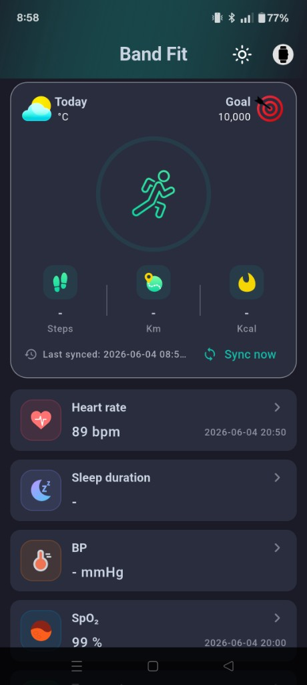
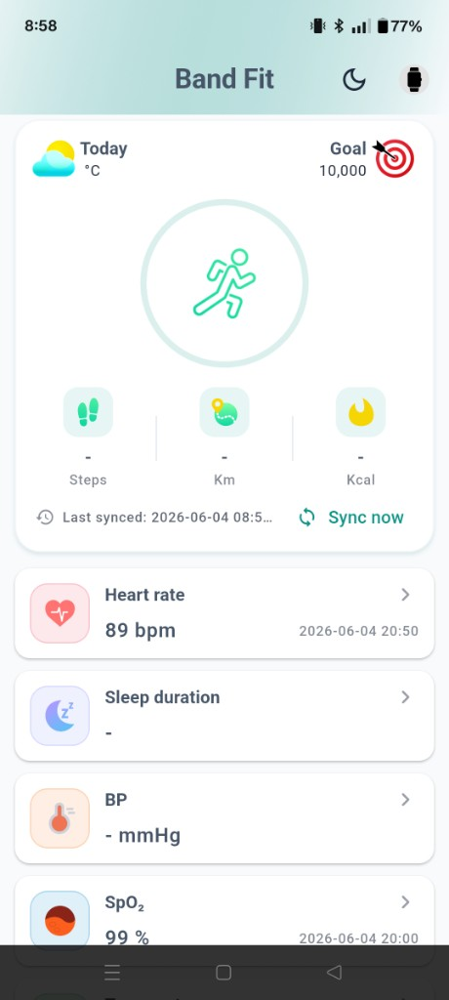
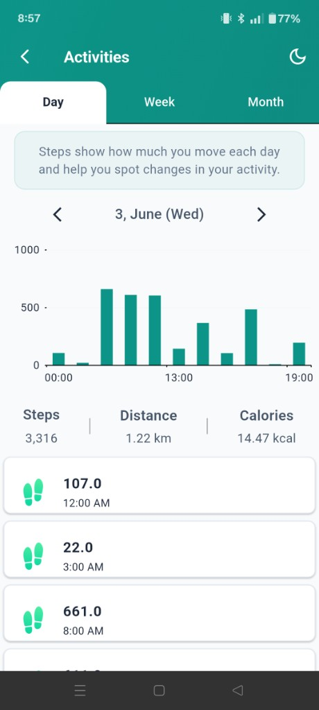
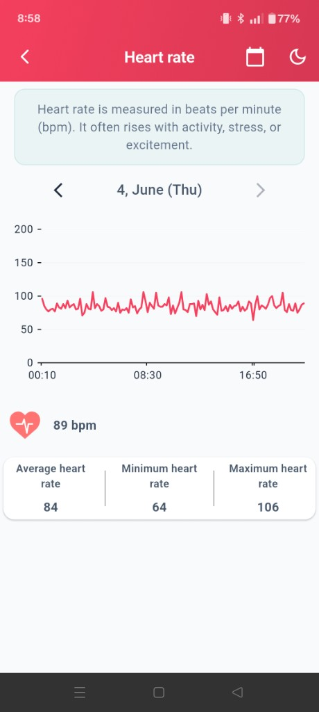
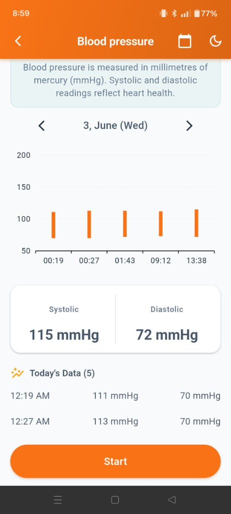
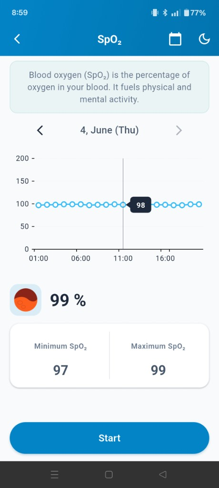

# Example app documentation

Documentation for the `flutter_band_fit` **plugin** and the **example** reference app (`flutter_band_fit_app`).

## About the plugin

- Targets **UTE smart band / fitness watch** devices over BLE.
- **The UTE SDK is the GloryFit SDK** — same native stack; UTE is the vendor package name in this repo (`ute_sdk` / `UTESmartBandApi`), GloryFit is the widely used name for that SDK on fitness bands.
- Provides a **single Flutter API** over the GloryFit/UTE SDK on Android and iOS (separate native binaries per platform, one Dart contract).

A **full reference implementation** (pairing, sync, vitals UI, settings, dial, firmware, health export) ships in the `example/` package — not only API stubs.

## Screenshots

Example app captures from a connected UTE / GloryFit band (see [`screenshots/`](../../screenshots/) at the package root).

| Screen | Description |
| ------ | ----------- |
|  | Main dashboard — steps goal, sync, heart rate, sleep, BP, SpO₂ |
|  | Same dashboard in light theme |
|  | Daily steps chart, distance, and calories |
|  | Heart rate trend, average/min/max |
|  | BP readings chart and on-demand test |
|  | Blood oxygen trend and live measurement |

## Plugin integration (start here)

| Document | Description |
| -------- | ----------- |
| [Full implementation guide](plugin/full-implementation-guide.md) | End-to-end workflow, architecture, example app map |
| [Plugin integration guide](plugin/plugin-integration-guide.md) | Step-by-step integration for new apps |
| [Plugin API workflow reference](plugin/plugin-api-workflow.md) | `FlutterBandFit` methods by category |

## Example app architecture

| Document | Description |
| -------- | ----------- |
| [Feature-first clean architecture](architecture/clean-architecture.md) | Layers and feature layout |
| [Dependency rules](architecture/dependency-rules.md) | Import and boundary rules |
| [Feature template](architecture/feature-template.md) | Scaffold for new features |
| [ARCHITECTURE.md](../ARCHITECTURE.md) | High-level example overview |

## Changelog

- [CHANGELOG.md](../../CHANGELOG.md) — plugin version history (current release: **0.0.4**)
- [pub.dev package](https://pub.dev/packages/flutter_band_fit)

## Recommended reading order

1. [Full implementation guide](plugin/full-implementation-guide.md)
2. [Plugin integration guide](plugin/plugin-integration-guide.md)
3. [Plugin API workflow reference](plugin/plugin-api-workflow.md)
4. Run and explore `example/` (see [example/README.md](../README.md))
5. [ARCHITECTURE.md](../ARCHITECTURE.md) when extending the demo app

## License

The `flutter_band_fit` plugin and example app are licensed under the [MIT License](../../LICENSE).
